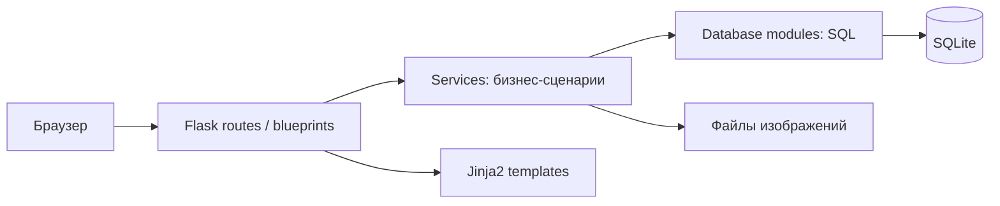
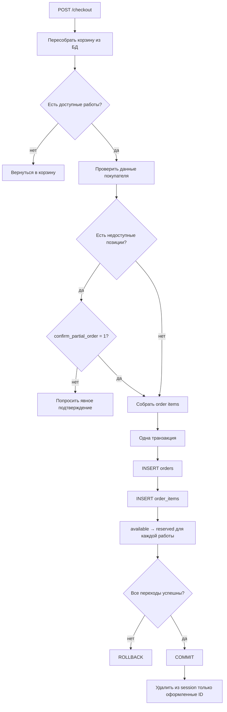
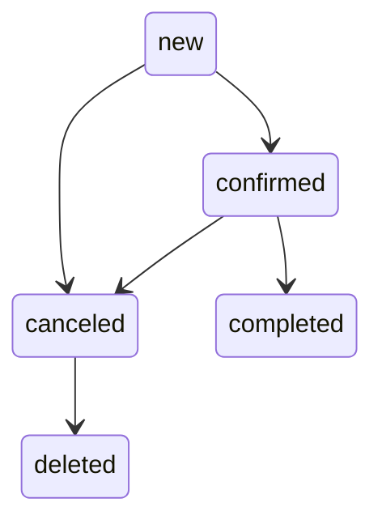

# PROJECT MAP — Ceramic Shop v2

Карта отражает текущее устройство проекта после завершения миграций `v001–v007` и удаления функциональности отзывов.

## 1. Общая архитектура



Главное направление зависимостей:

```text
route → service → database
```

Route отвечает за HTTP. Service координирует бизнес-сценарий и транзакцию. Database-модуль выполняет узкие SQL-операции.

## 2. Точка входа

```text
app.py
├── load_dotenv()
├── create_app(test_config=None)
│   ├── Flask
│   ├── конфигурация
│   ├── admin_bp
│   ├── main_bp
│   ├── глобальная CSRF-проверка POST
│   ├── cart_count context processor
│   └── csrf_token context processor
└── локальный запуск
    ├── init_db()
    └── app.run(..., debug=True)
```

`create_app()` позволяет тестам передать отдельный путь к базе и тестовые секреты.

## 3. Структура кода

```text
Ceramic_shop_v2/
├── app.py
├── validation.py
├── requirements.txt
├── requirements-dev.txt
├── database/
│   ├── connection.py
│   ├── schema.py
│   ├── migrations.py
│   ├── migration_versions/
│   │   ├── v001_create_products.py
│   │   ├── v002_add_categories.py
│   │   ├── v003_create_orders_with_json_items.py
│   │   ├── v004_add_order_status.py
│   │   ├── v005_expand_products.py
│   │   ├── v006_add_tags.py
│   │   └── v007_normalize_order_items.py
│   ├── products.py
│   ├── categories.py
│   ├── tags.py
│   ├── orders.py
│   ├── order_items.py
│   └── stats.py
├── services/
│   ├── cart_service.py
│   ├── category_service.py
│   ├── csrf_service.py
│   ├── image_service.py
│   ├── order_service.py
│   ├── product_service.py
│   └── tag_service.py
├── routes/
│   ├── main.py
│   └── admin/
│       ├── __init__.py
│       ├── auth.py
│       ├── dashboard.py
│       ├── products.py
│       ├── orders.py
│       ├── categories.py
│       └── tags.py
├── templates/
├── static/
├── tests/
└── .github/workflows/tests.yml
```

## 4. Публичные сценарии

### Главная

```text
GET /
→ get_all_products(only_featured=True, only_visible=True, is_archived=False)
→ index.html
```

### Каталог

```text
GET /catalog
→ category / tag / q / sort_by / order
→ проверка существования категории или тега
→ database/products.py
→ catalog.html
```

### Страница работы

```text
GET /product/<product_id>
→ работа + категория
→ проверка is_visible и is_archived
→ теги
→ product_page.html
```

### Корзина

```text
session["cart"] = {product_id: quantity}
        ↓
build_cart_summary()
        ├── повторно загружает работы из БД
        ├── вычисляет unavailable_reason
        ├── отделяет available_products
        ├── считает total только по доступным
        └── сохраняет недоступные позиции в отображении корзины
```

### Checkout



## 5. Административные сценарии

### Доступ

```text
admin_bp.before_request
├── /admin/login разрешён без сессии
└── остальные endpoints требуют session["is_admin"]
```

### Работа

```text
создание
→ валидация формы и тегов
→ сохранение нового изображения
→ INSERT product + replace tags в одной транзакции
→ rollback удаляет новый файл
```

```text
редактирование
→ проверка активного заказа
→ необязательное новое изображение
→ UPDATE product + replace tags
→ commit
→ только после commit удалить старый файл
```

```text
архивирование
→ работа существует
→ ещё не архивна
→ нет active order
→ is_archived = 1
```

```text
окончательное удаление
→ работа предварительно архивирована
→ нет active order
→ удалить связи и запись
→ commit
→ удалить загруженный файл
```

### Заказ



- редактировать можно только `new`;
- подтвердить можно только `new`;
- выполнить можно только `confirmed`;
- отменить можно `new` или `confirmed`;
- удалить можно только `canceled`.

## 6. Модель данных

```mermaid
erDiagram
    CATEGORIES ||--o{ PRODUCTS : category_id
    PRODUCTS ||--o{ PRODUCT_TAGS : product_id
    TAGS ||--o{ PRODUCT_TAGS : tag_id
    ORDERS ||--|{ ORDER_ITEMS : order_id
    PRODUCTS o|--o{ ORDER_ITEMS : product_id

    PRODUCTS {
        text id PK
        text name
        integer price
        text status
        integer is_visible
        integer is_for_sale
        integer is_archived
        integer is_featured
    }

    ORDERS {
        text id PK
        text status
        integer total
        timestamp created_at
    }

    ORDER_ITEMS {
        integer id PK
        text order_id FK
        text product_id FK_nullable
        text product_name
        integer unit_price
        integer quantity
    }
```

`order_items.product_name` и `unit_price` — исторический снимок. Удаление работы не уничтожает историю заказа: `product_id` становится `NULL`.

## 7. Транзакционные границы

Service-слой владеет одной транзакцией в сценариях:

```text
create_product_with_tags
update_product_with_tags
delete_product_with_image
update_product_state_with_order_check
archive_product_with_order_check
restore_archived_product
create_order_with_items
update_order_with_items
confirm_order
complete_order
cancel_order
delete_canceled_order
run_migrations — отдельная транзакция на каждую миграцию
```

## 8. Главные инварианты

```text
Недоступная работа не входит в заказ.
Заказ и его позиции создаются целиком либо не создаются.
Создание заказа резервирует каждую работу атомарно.
Активный заказ удерживает работу в reserved.
Отмена снимает резерв.
Выполнение отмечает работу как sold.
Активный заказ нельзя удалить.
Работу активного заказа нельзя вывести из reserved, архивировать или удалить.
Историческая позиция заказа переживает удаление работы.
Частичный checkout требует явного согласия.
Ошибка checkout не очищает корзину.
```

## 9. Тестовая инфраструктура

```text
create_app(test_config)
→ tmp_path/test_shop.db
→ app_context
→ db_connection fixture
→ run_migrations(MIGRATIONS)
→ тест
```

Тесты не используют локальную `shop.db` и проверяют как прикладные сценарии, так и сам migration runner.
