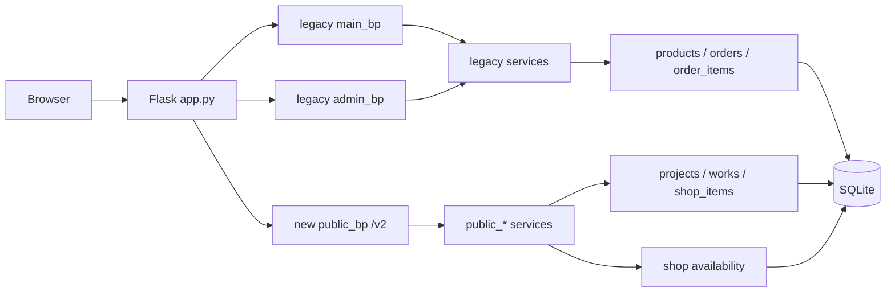
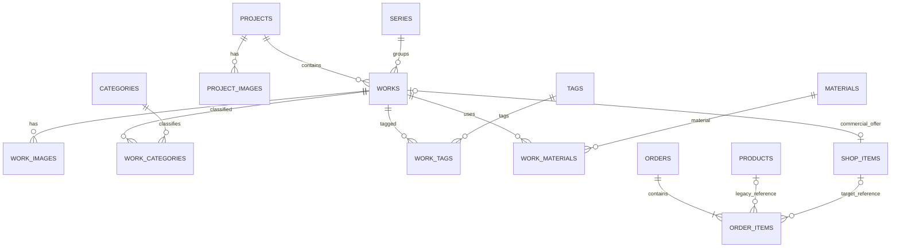

# PROJECT MAP — Ceramic Shop v2

Актуальная компактная карта репозитория.

**Срез:** `main`, commit `7d996da41b25bd033d2c52f431b4b6a84bfdcdce`, 2026-09-11.

## 1. Общая система



Главный архитектурный факт текущего этапа: **схема уже target-ready, а runtime переведён только частично**.

## 2. Точка входа

`app.py`:

```text
load_dotenv(.env)
↓
create_app(test_config=None)
├── Flask(__name__)
├── config
│   ├── SECRET_KEY
│   ├── ADMIN_LOGIN
│   ├── ADMIN_PASSWORD_HASH
│   ├── DATABASE
│   └── AUTO_INIT_DB
├── init_db() при AUTO_INIT_DB
├── register admin_bp
├── register main_bp
├── register public_bp
├── global POST CSRF guard
├── cart_count context processor
└── csrf_token context processor
```

Локальный `__main__` запускает development server с `debug=True`.

## 3. Основные директории

```text
Ceramic_shop_v2/
├── app.py
├── validation.py
├── database/
│   ├── connection.py
│   ├── migrations.py
│   ├── schema.py
│   ├── migration_versions/v001...v013
│   ├── products.py
│   ├── projects.py
│   ├── works.py
│   ├── shop_items.py
│   ├── orders.py
│   ├── order_items.py
│   ├── categories.py
│   ├── tags.py
│   └── stats.py
├── services/
│   ├── product_service.py
│   ├── cart_service.py
│   ├── order_service.py
│   ├── category_service.py
│   ├── tag_service.py
│   ├── image_service.py
│   ├── csrf_service.py
│   ├── public_home_service.py
│   ├── public_work_service.py
│   ├── public_project_service.py
│   ├── public_shop_service.py
│   └── shop_availability_service.py
├── routes/
│   ├── main/
│   ├── admin/
│   └── public/
├── templates/
│   ├── legacy templates...
│   └── public/
│       ├── base.html
│       ├── home.html
│       ├── work.html
│       └── project.html
├── static/
│   ├── legacy assets...
│   └── public/
│       ├── css/site.css
│       ├── css/work.css
│       ├── css/project.css
│       ├── js/site.js
│       └── js/work.js
├── tests/
├── docs/
├── .github/workflows/tests.yml
├── requirements.txt
├── requirements-dev.txt
└── pyproject.toml
```

## 4. Blueprints и маршруты

### Legacy `main_bp`

Без prefix:

```text
/                       legacy homepage
/catalog                legacy Product catalog
/product/<product_id>   legacy Product detail
/cart                   legacy session cart
/checkout               legacy checkout
/order_success/<id>     legacy order success
```

Плюс POST-маршруты добавления/удаления/очистки корзины.

### Legacy `admin_bp`

```text
/admin/login
/admin/logout
/admin/...
```

Модули: auth, dashboard, products, orders, categories, tags.

### New `public_bp`

Prefix:

```text
/v2
```

Реализовано:

```text
/v2/                    new homepage
/v2/works/<slug>        new Work detail
/v2/projects/<slug>     new Project detail
```

Ещё не зарегистрированы отдельные index/routes для:

```text
/v2/works
/v2/projects
/v2/shop
```

При этом backend `public_shop_service.py` уже существует.

## 5. Предметная модель



Особенность: Work может принадлежать либо Project, либо Series; schema CHECK запрещает одновременный `project_id` и `series_id`.

## 6. Shop availability

Stored:

```text
shop_items.stock_quantity
shop_items.is_published
shop_items.is_orderable
shop_items.is_retired
```

Derived:

```text
reserved_quantity =
SUM(order_items.quantity)
для orders status IN ('new', 'confirmed')

available_quantity =
stock_quantity - reserved_quantity
```

`shop_availability_service.py` дополнительно выдаёт:

```text
stock_state:
available
fully_reserved
out_of_stock

can_order:
published
AND orderable
AND not retired
AND available_quantity > 0
```

## 7. Migration chain

```text
v001 Product
v002 Categories
v003 Orders
v004 Order status
v005 Product expansion
v006 Tags
v007 normalized OrderItem
v008 artistic core
v009 artistic backfill + preflight
v010 Shop core
v011 Shop backfill + preflight
v012 OrderItem.shop_item_id
v013 active OrderItem → ShopItem bridge
```

Каждая pending migration выполняется в собственной явной транзакции `BEGIN → apply → record → commit`, с rollback на исключении.

## 8. Frontend v2

Shared:

```text
templates/public/base.html
static/public/css/site.css
static/public/js/site.js
```

Work-specific:

```text
templates/public/work.html
static/public/css/work.css
static/public/js/work.js
```

Project-specific:

```text
templates/public/project.html
static/public/css/project.css
```

`site.js` усиливает mobile navigation через `is-enhanced/is-open`.

`work.js` содержит два независимых enhancement-компонента:

```text
Story disclosure
Work carousel
```

HTML остаётся источником контента; JS не строит страницы с нуля.

## 9. Тестовая карта

В `tests/` существуют отдельные группы для:

```text
connection / schema / migrations
migration versions
products / categories / tags
works / projects / shop_items
orders / order_items
legacy services
public home/work/project/shop services
shop availability
public routes
app factory
checkout integration
validation
```

CI:

```text
Ruff lint
Ruff format --check
pytest -q
```

## 10. Главная граница разработки

Сейчас нельзя говорить «старый код уже заменён».

Правильнее:

```text
DATA MODEL: target уже построен
PUBLIC READ-SIDE: частично переведён
COMMERCE WRITE-SIDE: ещё legacy
ADMIN: ещё legacy
PRODUCTION: впереди
```

До окончательного cutover старая Product-ветка остаётся рабочим историческим runtime и одновременно эталоном поведения для части коммерческих сценариев.
