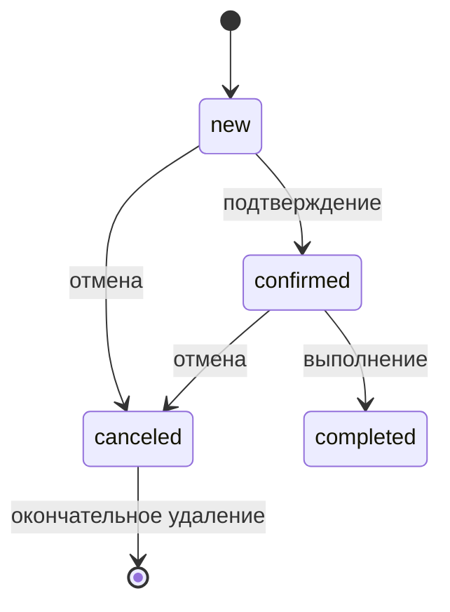

# Ceramic Shop v2

Сайт-портфолио и небольшая коммерческая витрина керамических работ художницы Полины Яланской.

Проект сочетает две уже работающие части:

- публичную презентацию работ: главная, каталог, фильтры, смысловые теги и отдельные страницы;
- небольшой магазин уникальных объектов: session-корзина, checkout, резервирование и административный жизненный цикл заказа.

Сейчас это учебный, но уже содержательно цельный **модульный монолит на Flask и SQLite**. Проект ещё не готов к production: перед размещением предстоят предметное переосмысление `Project / Work / Shop item`, доработка безопасности, конфигурации, изображений и эксплуатационной инфраструктуры.

## Что уже реализовано

### Публичная часть

- главная страница с избранными опубликованными работами;
- каталог с категориями, поиском и сортировкой;
- фильтрация по смысловым тегам;
- отдельная страница опубликованной работы;
- session-корзина;
- повторная проверка доступности по базе;
- удаление недоступных позиций;
- полный и явно подтверждаемый частичный checkout;
- страница успешного заказа.

### Административная часть

- вход по логину и хешу пароля из переменных окружения;
- dashboard со статистикой;
- создание, редактирование, публикация, избранное и архивирование работ;
- управление категориями и тегами;
- загрузка и замена изображений;
- список и карточка заказов;
- редактирование нового заказа;
- подтверждение, выполнение, отмена и удаление отменённого заказа.

### Данные и надёжность

- SQLite с включёнными внешними ключами;
- `products`, `categories`, `tags`, `product_tags`, `orders`, `order_items`;
- история схемы через собственный migration runner;
- миграции `v001–v007`;
- снимки названия и цены в `order_items`;
- транзакционные сценарии с `commit / rollback`;
- временные тестовые базы;
- автоматический запуск `pytest` в GitHub Actions.

## Основные правила предметной модели

Работа доступна для оформления, только когда она:

```text
существует
не находится в архиве
опубликована
предназначена для продажи
имеет status = available
```

Создание заказа выполняет переход:

```text
product: available → reserved
order: создаётся со status = new
```

Жизненный цикл заказа:



Связанные состояния работы:

```text
создание заказа     available → reserved
отмена заказа       reserved  → available
выполнение заказа   reserved  → sold
```

## Технологии

- Python;
- Flask 3;
- SQLite;
- Jinja2;
- Werkzeug;
- python-dotenv;
- HTML, CSS и немного JavaScript;
- pytest;
- GitHub Actions.

## Быстрый запуск

```bash
git clone <URL-РЕПОЗИТОРИЯ>
cd Ceramic_shop_v2
python -m venv .venv
```

Активация Linux/macOS:

```bash
source .venv/bin/activate
```

Windows PowerShell:

```powershell
.\.venv\Scripts\Activate.ps1
```

Установка зависимостей для разработки:

```bash
python -m pip install -r requirements-dev.txt
```

Создайте `.env` по образцу `.env.example`.

```env
SECRET_KEY=...
ADMIN_LOGIN=admin
ADMIN_PASSWORD_HASH=...
```

Генерация значений:

```bash
python -c "import secrets; print(secrets.token_hex(32))"
python -c "from werkzeug.security import generate_password_hash; print(generate_password_hash('ВАШ_ПАРОЛЬ'))"
```

Локальный запуск:

```bash
python app.py
```

При первом запуске приложение:

1. создаёт локальный `shop.db`;
2. создаёт `schema_migrations`;
3. последовательно применяет `v001–v007`;
4. добавляет стартовые категории, теги и работы;
5. запускает Flask на `http://127.0.0.1:8000`.

Админка:

```text
http://127.0.0.1:8000/admin/login
```

> Текущий `app.py` запускает development server с `debug=True`. Это допустимо только локально и должно быть изменено до production.

## Тесты

```bash
python -m pytest
```

Тесты используют отдельные временные SQLite-файлы и создают схему через настоящий migration runner. Локальная `shop.db` при этом не затрагивается.

GitHub Actions повторяет запуск тестов при `push` и `pull_request`.

## Локальная база данных

`shop.db` — локальное состояние приложения, а не часть исходного кода. Файл и его журналы перечислены в `.gitignore` и не должны отслеживаться Git:

```text
shop.db
shop.db-journal
shop.db-shm
shop.db-wal
```

Проверка:

```bash
git ls-files shop.db
git check-ignore -v shop.db
```

Первая команда должна ничего не вывести, вторая — показать правило из `.gitignore`.

## Документация

Начинать с [docs/00_INDEX.md](docs/00_INDEX.md).

Ключевые документы:

- [PROJECT_MAP.md](PROJECT_MAP.md) — компактная карта модулей и сценариев;
- [docs/02_ARCHITECTURE.md](docs/02_ARCHITECTURE.md) — архитектурные границы;
- [docs/03_DOMAIN_MODEL.md](docs/03_DOMAIN_MODEL.md) — текущая модель данных и инварианты;
- [docs/04_DATABASE_AND_MIGRATIONS.md](docs/04_DATABASE_AND_MIGRATIONS.md) — устройство миграций;
- [docs/10_KNOWN_LIMITATIONS.md](docs/10_KNOWN_LIMITATIONS.md) — честный список ограничений;
- [docs/11_ROADMAP_TO_PRODUCTION.md](docs/11_ROADMAP_TO_PRODUCTION.md) — дальнейший путь.
