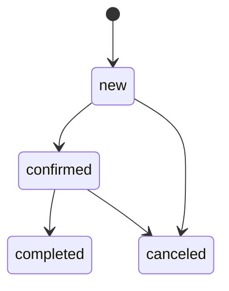

# Текущая предметная модель

## 1. Важное ограничение терминологии

В коде центральная сущность называется `product`. В пользовательских текстах она часто называется «работа».

Сейчас это одна запись, которая одновременно содержит:

- художественные сведения;
- признаки публикации;
- коммерческие сведения;
- состояние продажи.

Это **текущая реализованная модель**, но не окончательная модель будущего сайта.

## 2. Связи

```mermaid
ERDiagram
    CATEGORIES ||--o{ PRODUCTS : classifies
    PRODUCTS ||--o{ PRODUCT_TAGS : has
    TAGS ||--o{ PRODUCT_TAGS : describes
    ORDERS ||--|{ ORDER_ITEMS : contains
    PRODUCTS o|--o{ ORDER_ITEMS : references
    SCHEMA_MIGRATIONS {
        integer version PK
        text name
        timestamp applied_at
    }
```

## 3. `products`

| Поле | Смысл |
|---|---|
| `id TEXT PK` | UUID работы |
| `name` | название |
| `description` | авторское/публичное описание |
| `price` | цена в целых денежных единицах |
| `img` | URL одного основного изображения |
| `category_id` | необязательная FK на категорию в БД, но форма требует категорию |
| `status` | `available`, `reserved`, `sold` |
| `year` | год; БД допускает `NULL`, форма требует 1990–2100 |
| `materials` | строка материалов |
| `is_visible` | опубликована ли работа |
| `is_for_sale` | предназначена ли для продажи |
| `is_archived` | находится ли в административном архиве |
| `is_featured` | показывать ли на главной |

### Статус

```text
available — работа свободна
reserved  — работа удерживается активным заказом
sold      — работа продана через выполненный заказ
```

### Независимые флаги

`status` не заменяет:

- `is_visible`;
- `is_for_sale`;
- `is_archived`;
- `is_featured`.

Например, проданная работа теоретически может оставаться опубликованной как часть портфолио, но не может быть оформлена.

### Доступность для корзины

```text
product exists
AND is_archived = 0
AND is_visible = 1
AND is_for_sale = 1
AND status = 'available'
```

## 4. `categories`

Категория классифицирует тип работы:

```text
Вазы
Кружки
Тарелки
Чашки
Объекты
```

Поля:

- `id`;
- `name`;
- `slug`;
- `description`.

`name` и `slug` уникальны. Текущий интерфейс не разрешает удалить категорию, пока к ней привязаны работы.

## 5. `tags` и `product_tags`

Теги описывают смысловые темы:

```text
Дом
Память
Архитектура
Разрушение
Хрупкость
Природа
```

Связь many-to-many хранится в `product_tags` с составным первичным ключом:

```text
(product_id, tag_id)
```

Внешние ключи используют `ON DELETE CASCADE`, но административный интерфейс дополнительно запрещает удалить используемый тег.

## 6. `orders`

| Поле | Смысл |
|---|---|
| `id TEXT PK` | UUID заказа |
| `customer_name` | имя покупателя |
| `customer_email` | email |
| `customer_phone` | телефон, необязателен |
| `customer_address` | адрес, необязателен |
| `total` | сохранённая итоговая сумма |
| `status` | состояние заказа |
| `created_at` | дата создания SQLite |

### Статусы

```text
new        — создан, может редактироваться
confirmed  — подтверждён администратором
completed  — выполнен
canceled   — отменён
```

### Допустимые переходы



Повторный или неверный переход не проходит, потому что SQL обновляет заказ только при ожидаемом предыдущем статусе.

## 7. `order_items`

| Поле | Смысл |
|---|---|
| `id INTEGER PK` | идентификатор позиции |
| `order_id` | FK на заказ, `ON DELETE CASCADE` |
| `product_id` | nullable FK на работу, `ON DELETE SET NULL` |
| `product_name` | историческое название |
| `unit_price` | историческая цена |
| `quantity` | количество, больше нуля |

### Почему нужны снимки

Заказ должен помнить, что именно покупатель оформил, даже если позднее:

- работу переименовали;
- цену изменили;
- работу окончательно удалили.

Поэтому интерфейс заказа читает `product_name` и `unit_price` из `order_items`, а не из текущей `products`.

## 8. `schema_migrations`

Технический журнал:

- `version` — уникальный номер;
- `name` — имя миграции;
- `applied_at` — время применения.

Таблица определяет, какие версии уже прошли на конкретной базе.

## 9. Главные инварианты

### Заказ

- пустой заказ создать нельзя;
- `orders` и все `order_items` создаются одной транзакцией;
- каждая работа резервируется через ожидаемый статус `available`;
- ошибка одной позиции откатывает весь заказ;
- сумма вычисляется на сервере из сохранённых цен и количества.

### Активный заказ

Активными считаются `new` и `confirmed`.

Для связанной работы нельзя:

- вывести её из `reserved`;
- архивировать;
- окончательно удалить.

### Отмена

Отмена:

1. переводит заказ из `new` или `confirmed` в `canceled`;
2. переводит связанные работы из `reserved` в `available`;
3. откатывает всё при ошибке хотя бы одной работы.

### Выполнение

Выполнение:

1. допускается только из `confirmed`;
2. переводит заказ в `completed`;
3. переводит связанные работы из `reserved` в `sold`;
4. пропускает исторические позиции с `product_id = NULL`.

## 10. Будущая модель: открытый вопрос

Планируемые понятия:

```text
Project  — художественный контекст или серия
Work     — отдельное произведение
Shop item — конкретное коммерческое предложение
```

Пока не решено:

- Work принадлежит одному или нескольким Project;
- каждый ли Shop item связан с Work;
- может ли Shop item существовать самостоятельно;
- как представлять уникальные и складские позиции;
- как хранить варианты и тиражи;
- какие состояния портфолио и магазина независимы.

До фиксации ответов существующая `products` остаётся действующим источником истины.
