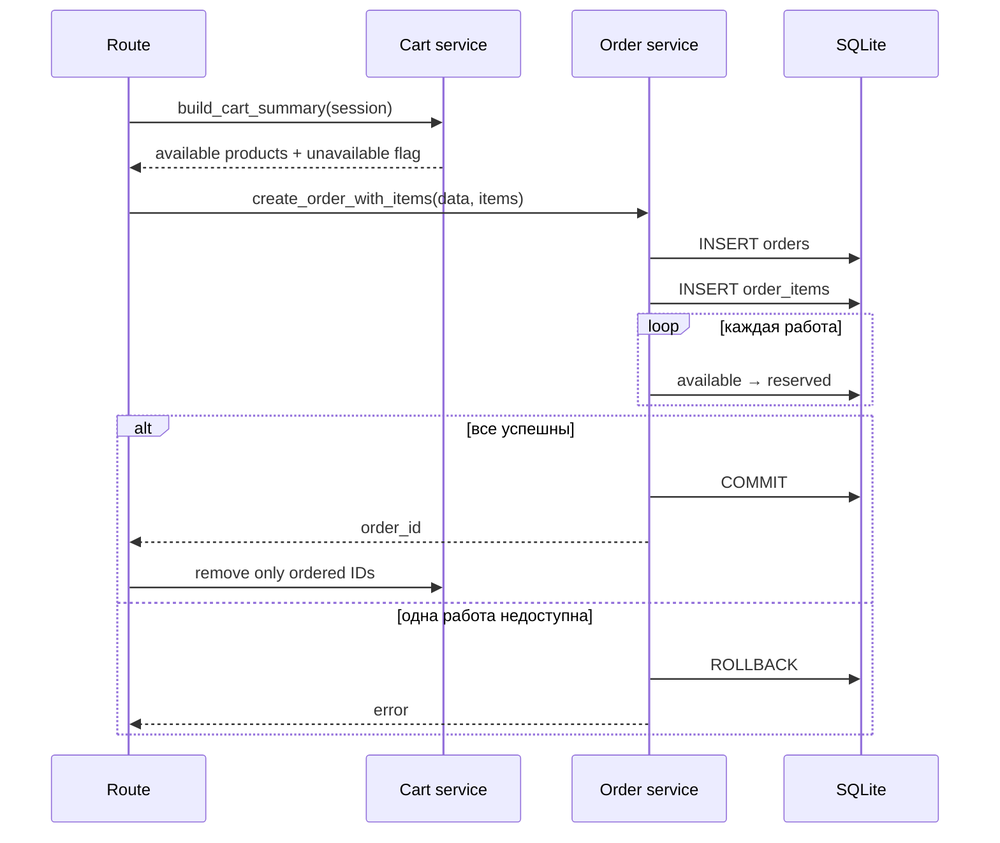

# Публичные сценарии

## 1. Главная — `GET /`

Route получает:

```text
неархивные
опубликованные
избранные
работы
```

и передаёт их в `index.html`.

Главная сейчас использует `products.is_featured` как ручной редакционный выбор.

## 2. Каталог — `GET /catalog`

Параметры:

| Параметр | Значение |
|---|---|
| `category` | slug категории |
| `tag` | slug тега |
| `q` | строка поиска |
| `sort_by` | `name` или `price` |
| `order` | `ASC` или `DESC` |

Публичная выборка всегда исключает:

- скрытые работы;
- архивные работы.

Некорректная категория или тег приводят к flash-сообщению и redirect в каталог.

Текущее ограничение: при выбранном теге используется отдельная выборка, и комбинация тега с категорией, поиском и сортировкой пока не реализована.

## 3. Страница работы — `GET /product/<id>`

Загружаются:

- поля работы;
- категория;
- связанные теги.

Страница недоступна, когда:

```text
product not found
OR is_visible != 1
OR is_archived == 1
```

Статус `sold` сам по себе не скрывает работу: это позволяет в будущем сохранять проданную работу в публичном портфолио.

## 4. Добавление в корзину — `POST /add_to_cart/<id>`

Route:

1. преобразует `quantity` в положительное целое;
2. загружает работу;
3. получает единую причину недоступности;
4. добавляет `id → quantity` в session;
5. возвращает redirect или AJAX JSON.

Даже если карточка была открыта ранее, доступность проверяется заново.

## 5. Представление корзины

Session хранит минимум:

```python
{
    "product-uuid": 1
}
```

Название, цена и статус не доверяются session и каждый раз загружаются из базы.

`build_cart_summary()` формирует:

- `products` — все найденные позиции с дополнительными полями;
- `available_products` — только доступные;
- `total` — сумма доступных;
- `cart_count` — сумма количеств в session;
- `has_unavailable_items`;
- `unavailable_reason` для каждой позиции.

Удалённый из базы ID определяется как недоступный, даже если запись больше не может быть показана.

## 6. Удаление недоступных

`POST /cart/remove_unavailable` повторно загружает работы и оставляет только ID, удовлетворяющие текущему правилу доступности.

Недоступная позиция не удаляется автоматически во время простого просмотра. Пользователь видит изменение и сам решает убрать её.

## 7. Checkout — GET

`GET /checkout`:

- отклоняет пустую корзину;
- отклоняет корзину без доступных работ;
- предупреждает о недоступных позициях;
- показывает только доступную часть и её сумму.

## 8. Checkout — POST

### Валидация покупателя

Обязательны:

- имя;
- email, содержащий `@`.

Телефон и адрес сейчас необязательны.

### Частичный заказ

Если в session есть доступные и недоступные позиции, требуется:

```text
confirm_partial_order = 1
```

Без явного согласия заказ не создаётся.

### Создание



## 9. Страница успеха — `GET /order_success/<order_id>`

Показывает заказ и исторические позиции.

Текущее ограничение безопасности: доступ определяется только знанием UUID заказа. Связь с конкретной browser-session пока не проверяется.

## 10. Пользовательские обещания системы

- Цена заказа берётся с сервера, а не из формы.
- Недоступная работа не включается молча.
- Частичный заказ не создаётся без подтверждения.
- Ошибка создания не очищает корзину.
- После успеха удаляются только реально оформленные позиции.
- История заказа не зависит от последующего редактирования работы.
