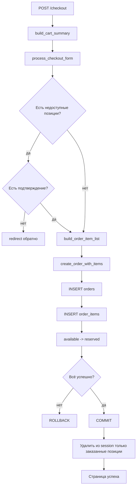

# 2. Архитектура и путь запроса

## Общая схема

Приложение — модульный Flask-монолит.

```text
браузер
   ↓ HTTP
route
   ↓
service
   ↓
database
   ↓
SQLite
```

Шаблоны Jinja2 формируют HTML, изображения хранятся в файловой системе.

## `app.py`

Отвечает за:

- создание Flask-приложения;
- загрузку `.env`;
- регистрацию blueprint;
- настройку session;
- общую CSRF-проверку POST;
- добавление `cart_count` и `csrf_token()` во все шаблоны;
- локальный запуск.

## `routes/`

Маршруты работают с HTTP:

- читают `request.args`, `request.form`, `request.files`;
- получают данные из `session`;
- вызывают сервисы и database-функции;
- показывают `flash`;
- делают `redirect`;
- передают данные в `render_template`.

Route не должен самостоятельно управлять большой транзакцией, если действие затрагивает несколько таблиц или файловую систему.

## `services/`

Сервисный слой отвечает за пользовательские сценарии и бизнес-правила:

```text
создать работу вместе с тегами
обновить работу и заменить изображение
создать заказ и зарезервировать работы
отменить заказ и снять резерв
выполнить заказ и отметить работы проданными
```

Сервис обычно определяет границу транзакции:

```python
conn = get_db_connection()

try:
    ...
    conn.commit()
except Exception:
    conn.rollback()
    raise
finally:
    conn.close()
```

## `database/`

Database-функции выполняют конкретный SQL. Низкоуровневые функции, участвующие в общей транзакции, получают `conn` аргументом и не делают собственный `commit()`.

## `templates/`

Шаблоны отображают состояние, формируют формы, передают CSRF и показывают только уместные действия. Они не должны заменять серверные бизнес-правила.

## `tests/`

Проверяются database-функции, сервисы, rollback, session-корзина, маршруты, авторизация, CSRF и переходы состояний.

## Пример создания заказа



## Зачем разделять слои

```text
route: что происходит с HTTP
service: что означает пользовательское действие
database: какой SQL выполняется
template: что видит человек
```
