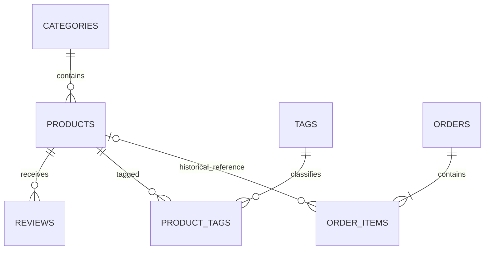

# 3. База данных и связи

## SQLite

Проект использует одну SQLite-базу. Для каждого соединения необходимо включать внешние ключи:

```sql
PRAGMA foreign_keys = ON;
```

Без этого `ON DELETE CASCADE` и `ON DELETE SET NULL` не работают.

## Основные таблицы



### `categories`

```text
id
name
slug
description
```

### `products`

```text
id UUID
name
description
price
status
img
category_id
year
materials
is_visible
is_for_sale
is_archived
is_featured
```

Цена хранится целым числом, чтобы не использовать float для денег. Булевы флаги представлены `0` и `1`.

### `tags` и `product_tags`

`product_tags` реализует many-to-many:

```sql
PRIMARY KEY (product_id, tag_id)
```

Составной ключ не позволяет дважды связать одну работу с одним тегом.

### `orders` и `order_items`

Заказ разделён на общую часть и позиции.

`orders` хранит покупателя, контакты, сумму, статус и дату.

`order_items` хранит:

```text
id
order_id
product_id
product_name
unit_price
quantity
```

`product_name` и `unit_price` — исторический снимок. Изменение названия или цены работы не переписывает старый заказ.

Связь позиции с заказом:

```sql
FOREIGN KEY (order_id)
    REFERENCES orders(id)
    ON DELETE CASCADE
```

Связь позиции с работой:

```sql
FOREIGN KEY (product_id)
    REFERENCES products(id)
    ON DELETE SET NULL
```

При удалении работы позиция заказа остаётся, но `product_id` становится `NULL`.

## Ограничения, которых пока нет

Схема пока не содержит SQL `CHECK` для допустимых статусов, положительной цены, положительного количества и булевых флагов. Эти правила поддерживаются Python-кодом.

В будущем можно добавить:

```sql
CHECK (quantity > 0)
CHECK (price >= 0)
CHECK (status IN ('available', 'reserved', 'sold'))
```

## Возможные индексы

```sql
CREATE INDEX idx_products_category_id ON products(category_id);
CREATE INDEX idx_products_status ON products(status);
CREATE INDEX idx_order_items_order_id ON order_items(order_id);
CREATE INDEX idx_order_items_product_id ON order_items(product_id);
CREATE INDEX idx_orders_status ON orders(status);
CREATE INDEX idx_orders_created_at ON orders(created_at);
```

Для маленькой базы это не срочно, но миграционная система должна позволить добавить индексы позже.
