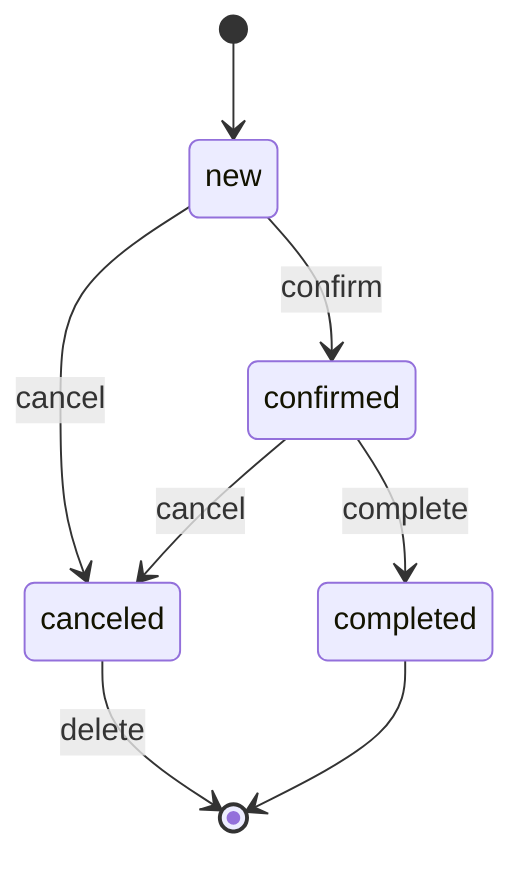

# 8. Заказы и машина состояний

## Статусы

```text
new        — новый
confirmed  — подтверждён
completed  — выполнен
canceled   — отменён
```

## Переходы



Вместо произвольного `set_status` существуют предметные действия:

```text
confirm_order
complete_order
cancel_order
delete_canceled_order
```

## Подтверждение

```text
new → confirmed
```

Работы остаются `reserved`. SQL проверяет ожидаемое предыдущее состояние.

## Выполнение

```text
confirmed → completed
reserved → sold
```

Если хотя бы одна работа не переводится в `sold`, вся операция откатывается.

## Отмена

Допустима для `new` и `confirmed`:

```text
заказ → canceled
работы reserved → available
```

Позиции заказа сохраняются.

## Удаление

Физически удалить можно только `canceled`. Позиции удаляются через `ON DELETE CASCADE`, работы остаются.

## Редактирование

Контакты и количества редактируются только пока заказ `new`.

Позиция обновляется:

```sql
UPDATE order_items
SET quantity = ?
WHERE id = ?
  AND order_id = ?
```

`order_id` защищает от изменения позиции другого заказа.

## Активный заказ

Активными считаются `new` и `confirmed`.

```sql
SELECT 1
FROM order_items
JOIN orders ON orders.id = order_items.order_id
WHERE order_items.product_id = ?
  AND orders.status IN ('new', 'confirmed')
LIMIT 1
```

Проверка используется при изменении и удалении работы.

## Инварианты

```text
new/confirmed заказ владеет reserved работами
completed заказ связан с sold работами
canceled заказ освобождает работы
активный заказ нельзя физически удалить
переход выполняется только из ожидаемого статуса
заказ и его последствия меняются атомарно
```
