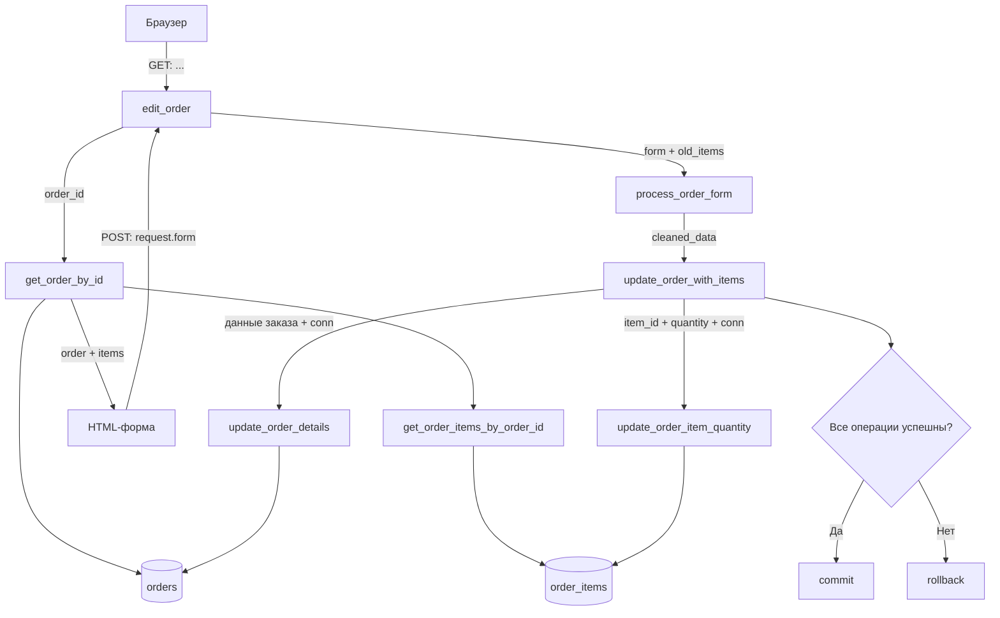
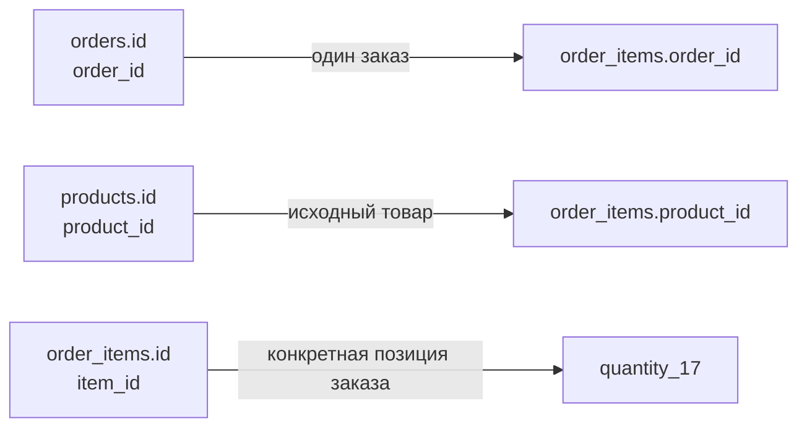

---

title: "Сценарий: редактирование заказа"
project: "Ceramic_shop_v2"
topic:
  - Flask
  - SQLite
  - orders
  - order_items
  - data-flow
status: draft
created: YYYY-MM-DD
tags:
  - ceramic-shop
  - architecture
  - learning
  - scenario
---

---

# Сценарий: редактирование заказа

> [!abstract] Задача
> Проследить полный путь данных в сценарии, где администратор открывает существующий заказ, меняет имя покупателя и количество одной позиции, после чего сохраняет изменения.
>
> Важно описать не только последовательность функций, но и:
>
> * какие данные получает каждая функция;
> * что она с ними делает;
> * что возвращает;
> * кому передаёт результат;
> * где появляется и исчезает `conn`;
> * где выполняются `commit()` и `rollback()`;
> * чем отличаются `order_id`, `item_id` и `product_id`.

---

# 0. Статус работы

## Этапы

* [ ] Описаны исходные данные
* [ ] Разобраны идентификаторы
* [ ] Прослежен GET-запрос
* [ ] Разобрано формирование HTML-формы
* [ ] Прослежен POST-запрос
* [ ] Разобрана `process_order_form()`
* [ ] Разобрана `update_order_with_items()`
* [ ] Разобраны DB-функции
* [ ] Разобрана успешная транзакция
* [ ] Разобран `rollback`
* [ ] Составлена итоговая схема
* [ ] Выписаны оставшиеся вопросы
* [ ] Сценарий сверен с реальным кодом

## Моя текущая уверенность

Оценка понимания до начала работы:

`_5_/10`

Оценка понимания после завершения:

`__/10`

---

# 1. Формулировка сценария

## Начальное состояние

В базе уже существует заказ:

```text
order_id: "order-abc"
покупатель: "Денис"
email: "old@example.com"
статус: "new"
итоговая сумма: 30000
```

В заказе находится одна позиция:

```text
item_id: 17
product_id: "product-123"
название: "Башня"
цена за единицу: 30000
количество: 1
```

## Действие администратора

Администратор открывает страницу редактирования заказа и меняет:

```text
Имя:
"Денис" → "Новое имя"

Количество:
1 → 3
```

Остальные данные остаются прежними.

## Ожидаемый результат

```text
Новое имя покупателя: "Новое имя"
Новое количество: 3
Новая итоговая сумма: 90000
```

## Сценарий одной фразой

> Редактирование данных заказа администратором: изменение личных данных покупателя и количества заказанных работ.

---

# 2. Исходное состояние базы

## Таблица `orders`

| Поле               |            Значение | Что означает                                                         |
| ------------------ | ------------------: | -------------------------------------------------------------------- |
| `id`               |       `"order-abc"` | UUID идентификатор заказа, первичный ключ таблицы `orders`           |
| `customer_name`    |           `"Денис"` | Имя клиента                                                          |
| `customer_email`   | `"old@example.com"` | email клиента                                                        |
| `customer_phone`   |               `...` | Телефон клиента (необязательно)                                      |
| `customer_address` |               `...` | Адрес клиента (необязательно)                                        |
| `total`            |             `30000` | Общая стоимость заказа, вычисленная из исторических стоимостей работ |
| `status`           |             `"new"` | Статус заказа                                                        |
| `created_at`       |               `...` | Timestamp создания заказа                                            |

## Таблица `order_items`

| Поле           |        Значение | Что означает                                                                             |
| -------------- | --------------: | ---------------------------------------------------------------------------------------- |
| `id`           |            `17` | Числовой первичный ключ строки в `order_items`, уникален для в пределах таблицы          |
| `order_id`     |   `"order-abc"` | UUID идентификатор заказа, к которому относится позиция                                  |
| `product_id`   | `"product-123"` | UUID идентификатор работы из заказа (может быть пустым в случае полного удаления работы) |
| `product_name` |       `"Башня"` | Название работы                                                                          |
| `unit_price`   |         `30000` | Историческая стоимость работы                                                            |
| `quantity`     |             `1` | Количество в штуках                                                                      |

## Связь таблиц

Дополнить фразу:

> Строка `order_items` связана со строкой `orders`
 через поле `order_id`

```text
orders.id
    ?
order_items.order_id
```

---

# 3. Участники сценария

## Браузер и HTML-форма

**Получает:**

* `order` — полные подготовленные данные о заказе, которые предстоит изменять
* order_statuses — словарь допустимых статусов заказа вида:
	```python
	{
		'new': 'Новый',
		'processing': 'В работе',
		'completed': 'Выполнен',
		'cancelled': 'Отменён'
	}
	```

**Показывает пользователю:**

* Поля для редактирования личных данных покупателя
* Список работ из заказа с возможностью изменить количество

**Отправляет серверу:**

* Изменённые (или прежние) личные данные покупателя
* Изменённое (или прежнее) количество товаров в заказе

**Не должен самостоятельно решать:**

* Браузер выполняет предварительную проверку, но окончательная валидация происходит на стороне сервера.
* Когда открывать и закрывать соединение с базой данных

---

## Flask-маршрут

Название функции:

```python
edit_order(...)
```

Файл:

```text
routes/admin/orders.py
```

**Получает:**

* `order_id` — номер заказа, чтобы понимать, какой заказ редактировать.
* при POST-запросе маршрут получает доступ к данным формы через request.form и передаёт их сервису.

**Вызывает:**

* `get_order_by_id(order_id)` — ищет заказ
* `process_order_form(request.form, order['items'])` — валидирует данные из формы, возвращая очищенные данные
* `update_order_with_items(order_id, data)` — меняет и сохраняет данные в базе данных

**Отвечает за:**

* Отображение данных для пользователя
* Сбор неочищенных данных для дальнейших с ними взаимодействий

**Не отвечает за:**

* Валидацию данных
* Взаимодействия с базой данных посредством формирования SQL-запросов и управления транзакцией, но может вызывать соответствующие функции и сервисы

---

## Сервисный слой

Основные функции:

```python
process_order_form(...)
update_order_with_items(...)
```

Файл:

```text
services/order_service.py
```

**Отвечает за:**

* Валидацию пользовательских данных
* Создание сообщений об обычных ошибках
* Создание цельного словаря с очищенными данными
* `update_order_with_items()` владеет соединением и транзакцией составного обновления заказа.

**Почему эта логика находится не в маршруте:**

> Маршрут отвечает только за связь с шаблоном. Всё остальное организует сервис.

---

## DB-слой

Основные функции:

```python
get_order_by_id(...)
get_order_items_by_order_id(...)
update_order_details(...)
update_order_item_quantity(...)
```

Файлы:

```text
database/orders.py
database/order_items.py
```

**Отвечает за:**

* формулирование запросов к базе данных
* Выбор, добавление, удаление, обновление

**Не должен отвечать за:**

* DB-слой может открывать соединение для самостоятельного чтения. Но функции, участвующие в составной транзакции, получают готовый conn и не закрывают его сами.
* Обработку ошибок
* Валидацию

---

## SQLite

**Хранит:**

* Таблицы с данными о заказах, товарах и прочем
* Связи между таблицами, настройки

**Гарантирует:**

* что таблицы будут хранить данные в верном формате
* что будут соблюдаться правила внешних ключей, связь таблиц, верные действия с детьми при удалении родителя. Используются такие ограничения как PRIMARY KEY, NOT NULL, FOREIGN KEY, ON DELETE CASCADE и так далее.

---

# 4. Карта идентификаторов

> [!important]
> В этом разделе не описывать идентификаторы как «какие-то ID». Для каждого нужно точно указать, какую сущность он идентифицирует.

## `order_id`

Пример:

```text
"order-abc"
```

| Вопрос                                          | Мой ответ                                                                                                                           |
| ----------------------------------------------- | ----------------------------------------------------------------------------------------------------------------------------------- |
| Что именно идентифицирует?                      | Заказ                                                                                                                               |
| В какой таблице является первичным ключом?      | С этим названием ни в какой. В таблице является первичным ключом с названием "id"                                                   |
| В какой таблице используется как внешний ключ?  | order_items                                                                                                                         |
| Кто его создаёт?                                | `order_id` создаёт `create_order_with_items()` с помощью `uuid.uuid4()`. `insert_order` сохраняет в таблицу уже созданное значение. |
| Откуда он приходит в маршрут редактирования?    | Из динамической части URL. Затем маршрут передаёт его DB-функции.                                                                   |
| Для чего он передаётся сервису?                 | Чтобы было понятно какой заказ изменять                                                                                             |
| Что произойдёт с позициями при удалении заказа? | Позиции заказа удалятся вместе с заказом из-за настроек внешнего ключа                                                              |

Моё объяснение своими словами:

> `order_id` — общий идентификатор заказа. В `orders` он является первичным ключом, а в `order_items` связывает позиции с их заказом

---

## `item_id`

В базе поле называется:

```text
order_items.id
```

В Python его часто называют:

```text
item_id
```

Пример:

```text
17
```

| Вопрос                                    | Мой ответ                                                                                                                                      |
| ----------------------------------------- | ---------------------------------------------------------------------------------------------------------------------------------------------- |
| Что именно идентифицирует?                | Позицию работы в составе одного заказа                                                                                                         |
| Почему это не `order_id`?                 | `order_id` служит для идентификации самого заказа, а `item_id` указывает на номер работы в заказе                                              |
| Почему это не `product_id`?               | `product_id` указывает на uuid существующей в базе данных работы и может отсутствовать (быть null), а `item_id` остаётся в историческом снимке |
| Кто создаёт это значение?                 | SQLite автоматически создаёт `item_id` при `INSERT`. `insert_order_item()` возвращает созданное значение через `cursor.lastrowid`.             |
| В какой момент оно попадает в HTML?       | Во время рендеринга страницы `order_form` в составе `order`                                                                                    |
| В какой момент оно возвращается из формы? | Когда пользователь нажимает "Сохранить" на странице редактирования заказа                                                                      |
| Для чего оно нужно при `UPDATE`?          | Чтобы определить у какой именно позиции заказа изменяется количество                                                                           |

Моё объяснение своими словами:

> Идентификатор `item_id` нужен для определения конкретной позиции заказа, связи инпутов в шаблоне с обработкой данных из них на бэкенде.

---

## `product_id`

Пример:

```text
"product-123"
```

| Вопрос                                                                    | Мой ответ                                                                                                                                                                                                                   |
| ------------------------------------------------------------------------- | --------------------------------------------------------------------------------------------------------------------------------------------------------------------------------------------------------------------------- |
| Что именно идентифицирует?                                                | uuid работы в таблице `products`                                                                                                                                                                                            |
| В какой таблице является первичным ключом?                                | `products`                                                                                                                                                                                                                  |
| Зачем хранится в `order_items`?                                           | Он является внешним ключом в таблице `order_items` и существует для связывания оной с таблицей `products`. Пока работа не удалена, можно точно понять, на какую именно, условно, карточку товара ссылается позиция в заказе |
| Может ли стать `NULL`?                                                    | Может, при полном удалении работы из базы данных                                                                                                                                                                            |
| Что останется после удаления товара?                                      | Останутся `product_name`, `unit_price` и `quantity` в историческом снимке заказа                                                                                                                                            |
| Почему не используется как основной ID при редактировании позиции заказа? | Потому что `item_id` надёжнее: он точно существует, если существует заказ                                                                                                                                                   |

Моё объяснение своими словами:

> `product_id` связывает таблицы `order_items` и `products`. Пока существует, точно указывает на карточку товара, позиция которой редактируется. Становится `NULL` в случае удаления работы из базы данных.

---

## Сравнение трёх идентификаторов

| Идентификатор | Что идентифицирует     |          Пример | Где создаётся                                     | Где используется                                           |
| ------------- | ---------------------- | --------------: | ------------------------------------------------- | ---------------------------------------------------------- |
| `order_id`    | Заказ                  |   `"order-abc"` | В `insert_order`                                  | В создании заказа, в редактировании заказа                 |
| `item_id`     | Позицию в заказе       |            `17` | В `insert_order_item`                             | В создании заказа, в редактировании заказа                 |
| `product_id`  | Работу из этой позиции | `"product-123"` | В `insert_product` в случае создания новой работы | В создании товара,  создании заказа, редактировании заказа |

## Главная разница

Дополнить:

> `order_id` отвечает на вопрос «какой заказ?», `item_id` отвечает на вопрос «какая позиция?», а `product_id` отвечает на вопрос «какая работа?».

---

# 5. Общая схема сценария

Заполнить подписи к стрелкам:

```text
Браузер
    │
    │  GET /admin/orders/edit/order-abc
    │  передаёт: http-метод "GET" и order_id как часть URL
    ▼
edit_order()
    │
    │  вызывает: `get_order_by_id`
    │  передаёт: `order_id`
    ▼
get_order_by_id()
    │
    ├── SELECT FROM orders
    │
    └── get_order_items_by_order_id()
            │
            └── SELECT FROM order_items

Полученный заказ
    │
    │  передаётся в шаблон
    ▼
HTML-форма
    │
    │  POST
    │  передаёт: необработанные данные от пользователя
    ▼
edit_order()
    │
    ▼
process_order_form()
    │
    │  возвращает: словарь с обработанными и подготовленными данными
    ▼
update_order_with_items()
    │
    ├── update_order_details()
    │
    └── update_order_item_quantity()
    │
    ▼
commit() или rollback()
```

---

# 6. Часть I. Открытие формы — GET-запрос

## 6.1. URL

Предполагаемый URL:

```text
/admin/orders/edit/order-abc
```

Разобрать:

```text
/admin/orders/edit/
```

означает:

> Статический префикс маршрута. Сюда приходят запросы на редактирование заказов

А часть:

```text
order-abc
```

означает:

> Динамическая часть, order_id

## 6.2. Как `order_id` попадает в маршрут

Сигнатура маршрута:

```python
def edit_order(order_id):
```

Ответить:

* Откуда Flask берёт значение `order_id`?
* Почему имя параметра в URL и имя аргумента функции должны согласовываться?
* Какое значение окажется в переменной `order_id`?

Мой ответ:

> Flask берёт значение `order_id` из URL-адреса, извлекая его динамическую часть (то, что после последнего слэша). Имя переменной в маршруте определяет имя аргумента, с которым Flask вызывает функцию. В переменной `order_id` окажется значение "order-abc".

## 6.3. Вызов `get_order_by_id()`

```python
order = get_order_by_id(order_id)
```

### Входные данные

```python
order_id = "order-abc"
```

### Что делает функция

1. Открывает соединение.

2. Получает строку из orders.

3. Если заказа нет — возвращает None.

4. Превращает строку заказа в dict.

5. Через то же соединение получает строки order_items.

6. Превращает позиции в словари.

7. Добавляет список в order["items"].

8. Возвращает собранный заказ.

9. В finally закрывает соединение.

### Где открывается соединение

```python
conn = None
try:
	conn = get_db_connection()
```

Объяснение:

> conn заранее получает None, чтобы finally мог определить, успело ли соединение открыться.

### Где соединение закрывается

```python
finally:
    if conn is not None:
	    conn.close()
```

Объяснение:

> Соединение должно быть закрыто в любом случае, вне зависимости от наличия ошибок или позитивного результата после обработки запроса

---

# 7. Работа `get_order_by_id()`

## 7.1. Чтение строки `orders`

Пример запроса:

```sql
SELECT *
FROM orders
WHERE id = ?
```

### Что передаётся вместо `?`

```python
(order_id,)
```

### Почему параметр записывается кортежем

> Потому что согласно требованиям самого sqlite второй аргумент должен быть последовательностью. Кортеж стал негласным стандартом в силу своей неизменяемости, но можно использовать и, например, список. Запятая делает `(order_id,)` одноэлементным кортежем. От SQL-инъекции защищает передача значения отдельно от SQL-текста через `?`.

### Что возвращает `fetchone()`

При найденном заказе:

> sqlite3.Row

При ненайденном заказе:

> None

---

## 7.2. Преобразование `sqlite3.Row` в `dict`

```python
order = dict(order_row)
```

До преобразования:

```text
тип данных: sqlite3.Row
```

После преобразования:

```text
тип данных: dict
```

Зачем это делается:

> формат `sqlite3.Row` похож на словарь, но им не является. Превращение `sqlite3.Row` в `dict` делается, например, чтобы можно было добавить элементы в словарь, который будет возвращать функция для дальнейшего использования

---

## 7.3. Чтение позиций заказа

Вызов:

```python
saved_items = get_order_items_by_order_id(
    conn=conn,
    order_id=order_id,
)
```

### Что функция получает

| Аргумент   | Значение              | Откуда пришёл                                                 |
| ---------- | --------------------- | ------------------------------------------------------------- |
| `conn`     | `get_db_connection()` | Из `get_order_by_id`                                          |
| `order_id` | `order-abc`           | Из `get_order_by_id`, а в неё из `edit_order`, а в неё из URL |

### Что делает SQL

```sql
SELECT ...
FROM order_items
WHERE order_id = ?
ORDER BY id
```

Объяснить условие:

```sql
WHERE order_id = ?
```

> Фильтр по uuid заказа

Объяснить сортировку:

```sql
ORDER BY id
```

> Результат отображается в порядке увеличения номера позиции

---

## 7.4. Добавление списка позиций в заказ

```python
order["items"] = [
    dict(item)
    for item in saved_items
]
```

Объяснить по частям:

```python
for item in saved_items
```

> В `saved_items` лежат sqlite3.Row строки, которые содержат информацию о позициях в заказе. Они и перебираются одна за другой.

```python
dict(item)
```

> И каждая из них превращается в обычный словарь

```python
[...]
```

> Создаётся список из словарей

```python
order["items"] = ...
```

> Этот список добавляется в словарь `order` в качестве значения ключа `items`

---

## 7.5. Итоговый объект `order`

Заполнить реальными значениями:

```python
order = {
    "id": "order-abc",
    "customer_name": "Денис",
    "customer_email": "old@example.com",
    "customer_phone": "",
    "customer_address": "",
    "total": 30000,
    "status": "new",
    "created_at": "...",
    "items": [
        {
            "id": 17,
            "order_id": "order-abc",
            "product_id": "product-123",
            "product_name": "Башня",
            "unit_price": 30000,
            "quantity": 1
        }
    ]
}
```

---

# 8. Передача заказа в шаблон

Маршрут вызывает:

```python
render_template(
    "admin/order_form.html",
    order=order,
    order_statuses=ORDER_STATUSES
)
```

## Что получает Jinja

> Jinja получает данные заказа в виде словаря для предварительного заполнения формы и словарь статусов для `<select>`.

## Какие части заказа используются для обычных полей формы

| HTML-поле | Значение из `order` |
| --------- | ------------------- |
| Имя       | `customer_name`     |
| Email     | `customer_email`    |
| Телефон   | `customer_phone`    |
| Адрес     | `customer_address`  |
| Статус    | `status`            |

## Какие части используются для позиций

> `id`,  product_name`, `quantity` 

---

# 9. Формирование полей количества

Цикл шаблона:

```jinja2

    <div class="admin-form-group">
            <label for="quantity_{{ item['id'] }}">
                {{ item['product_name'] }}
            </label>
            <input type="number"
                   name="quantity_{{ item['id'] }}"
                   id="quantity_{{ item['id'] }}"
                   value="{{ item['quantity'] }}"
                   min="1">
        </div>

```

## Что такое `item` в одном проходе цикла

```python
item = {
    "id": 17,
    "order_id": "order-abc"
    "product_id": "product-123"
    "product_name": "Башня",
    "unit_price": 30000
    "quantity": 1
}
```

## Имя HTML-поля

```jinja2
name="quantity_{{ item['id'] }}"
```

Для позиции с ID `17` получится:

```html
name="quantity_17"
```

## Значение HTML-поля

```jinja2
value="{{ item['quantity'] }}"
```

Получится:

```html
value="1"
```

## Почему используется `item["id"]`

> Обновляется строка order_items, поэтому используется собственный ID этой строки, а не ID товара из products.

## Почему не используется `item["product_id"]`

> Потому что он может отсутствовать

## Полная цепочка `item_id`

```text
order_items.id
    ↓
order["items"]
    ↓
item["id"]
    ↓
name="quantity_17"
```

---

# 10. Часть II. Отправка формы — POST-запрос

## 10.1. Что меняет администратор

| Поле       |      Было |         Стало |
| ---------- | --------: | ------------: |
| Имя        | `"Денис"` | `"Новое имя"` |
| Количество |       `1` |           `3` |

## 10.2. Приблизительное содержимое `request.form`

Заполнить:

```python
request.form = {
	"csrf_token": "...",
    "name": "Новое имя",
    "email": "old@example.com",
    "phone": "",
    "address": "",
    "status": "new",
    "quantity_17": "3"
}
```

> [!note]
> Значения из HTML-формы приходят строками.

## Почему количество приходит как `"3"`, а не `3`

> Потому что данные из формы всегда приходят строками

## Есть ли в форме `unit_price`

* [ ] Да
* [x] Нет

Почему:

> Потому что цена позиции остаётся прежней и приходит из сервера

## Есть ли в форме готовый `total`

* [ ] Да
* [x] Нет

Почему сервер не должен ему доверять:

> Потому что данные из формы можно подменить. Доверять нужно сохранённой исторической цене из order_items.unit_price, которую сервер загрузил из базы.

---

# 11. Вызов `process_order_form()`

```python
is_valid, error_message, data = process_order_form(
    request.form,
    order["items"],
)
```

## Два входных источника данных

| Источник         | Какие данные содержит                       |
| ---------------- | ------------------------------------------- |
| `request.form`   | Данные, которые ввёл пользователь           |
| `order["items"]` | Исторический снимок с информацией о позиции |

## Почему функции нужны старые позиции заказа

> Потому что данные в актуальной карточке товара могут отличаться от данных, которые видел покупатель, получить доверенный item_id, получить историческую unit_price, получить product_name для сообщения об ошибке, перебирать только реально существующие позиции, игнорировать неизвестные поля вроде quantity_999999.

## Что было бы опасно брать только из формы

> Название работы, так как оно могло измениться, цену, так как она может быть изменена, uuid работы, так как работа могла быть удалена и он бы в этом случае отсутствовал

---

# 12. Работа `process_order_form()`

## 12.1. Чтение контактных данных

Заполнить:

```python
name = "Новое имя"
email = "old@example.com"
phone = ""
address = ""
status = "new"
```

## Для чего используется `.strip()`

> Чтобы убрать возможно имеющиеся пробелы в начале и конце строки

## Какие проверки выполняются

* [x] Имя не пустое
* [x] Email корректен
* [x] Статус разрешён
* [x] Количество является числом
* [x] Количество не меньше единицы
* [ ] Другое: ...

---

## 12.2. Перебор старых позиций

```python
for old_item in old_items:
```

В нашем примере один `old_item` выглядит так:

```python
old_item = {
    "id": 17,
    "order_id": "order-abc",
    "product_id": "product-123",
    "product_name": "Башня",
    "unit_price": 30000,
    "quantity": 1
}
```

---

## 12.3. Получение `item_id`

```python
item_id = old_item["id"]
```

Результат:

```python
item_id = 17
```

Откуда это значение изначально пришло:

    SQLite создаёт order_items.id
    ↓
    get_order_items_by_order_id()
    ↓
    get_order_by_id()
    ↓
    order["items"]
    ↓
    old_items
    ↓
    old_item["id"]
    ↓
    item_id

---

## 12.4. Получение нового количества

```python
form.get(f"quantity_{item_id}", 1)
```

Подставить значение `item_id`:

```python
form.get("quantity_17", 1)
```

Что функция найдёт в `request.form`:

```text
"3"
```

---

## 12.5. Преобразование количества

```python
quantity = int("3")
```

До преобразования:

```text
значение: "3"
тип: str
```

После преобразования:

```text
значение: 3
тип: int
```

Почему преобразование может вызвать `ValueError`:

> Есть два возможных случая: невозможность преобразовать строку (`int("ABC")`) или пользователь может указать число меньше единицы

---

## 12.6. Получение цены

```python
unit_price = old_item["unit_price"]
```

Цена равна:

```python
unit_price = 30000
```

Почему цена берётся из `old_item`, а не из формы:

> Потому что данные из формы можно подменить

---

## 12.7. Расчёт стоимости позиции

Формула:

```text
subtotal = unit_price × quantity
```

Подстановка:

```text
subtotal = 30000 × 3
```

Результат:

```text
subtotal = 90000
```

---

## 12.8. Расчёт итоговой суммы

```python
total += subtotal
```

Начальное значение `total`:

```text
В коде до цикла:

items = []
total = 0
```

После обработки позиции:

```text
После цикла и получения позиции:

total = 90000

total выводится заново из исторических цен и новых количеств.
```


---

## 12.9. Формирование нового списка изменений

```python
items.append({
    "id": item_id,
    "quantity": quantity,
})
```

Полученный список:

```python
items = [
    {
        "id": 17,
        "quantity": 3
    }
]
```

## Почему здесь больше нет `product_name`

> Потому что в дальнейшем будет вызываться функция `update_order_item_quantity`, которой эти данные не нужны

## Почему здесь больше нет `unit_price`

> Та же причина

## Почему здесь остаётся `id`

> Для функции `update_order_item_quantity`


> data["items"] — это минимальная команда на изменение: найти существующую позицию и изменить только количество. Исторические название и цена намеренно остаются прежними.
---

# 13. Результат `process_order_form()`

Успешный результат:

```python
return True, "", cleaned_data
```

Заполнить `cleaned_data`:

```python
cleaned_data = {
    "name": "Новое имя",
    "email": "old@example.com",
    "phone": "",
    "address": "",
    "status": "new",
    "total": 90000,
    "items": [
        {
            "id": 17,
            "quantity": 3
        }
    ]
}
```

## Сравнение старых и новых позиций

| Свойство              | `old_items`                                                             | `data["items"]`                                   |
| --------------------- | ----------------------------------------------------------------------- | ------------------------------------------------- |
| Содержит `item_id`    | Да                                                                      | Да                                                |
| Содержит `order_id`   | Да                                                                      | Нет                                               |
| Содержит `product_id` | Да                                                                      | Нет                                               |
| Содержит название     | Да                                                                      | Нет                                               |
| Содержит цену         | Да                                                                      | Нет                                               |
| Содержит количество   | Да                                                                      | Да                                                |
| Назначение            | Полные сохранённые позиции заказа, используемые как доверенный источник | Минимальный список команд на изменение количества |

Моё объяснение:

> `old_items` нужны для отображения в форме, а `data["items"]` нужны для дальнейшей обработки

---

# 14. Возвращение в маршрут

Маршрут получает:

```python
is_valid = True
error_message = ""
data = {
	"name": "Новое имя",
    "email": "old@example.com",
    "phone": "",
    "address": "",
    "status": "new",
    "total": 90000,
    "items": [
        {
            "id": 17,
            "quantity": 3
        }
    ]
}
```

## Что происходит при ошибке валидации

> Показ `error_message` и редирект обратно в форму редактирования

## Что происходит при успехе

Вызывается:

```python
update_order_with_items(
    order_id=order_id,
    data=data,
)
```

---

# 15. Передача данных в `update_order_with_items()`

## Входные аргументы

```python
order_id = "order-abc"
```

```python
data = {
    "name": "Новое имя",
    "email": "old@example.com",
    "phone": "",
    "address": "",
    "status": "new",
    "total": 90000,
    "items": [
        {
            "id": 17,
            "quantity": 3
        }
    ]
}
```

## Разделение данных

| Данные             | Куда передаются                                                | Что обновляют         |
| ------------------ | -------------------------------------------------------------- | --------------------- |
| `order_id`         | В `update_order_details` и каждую `update_order_item_quantity` | Шапку и состав заказа |
| `data["name"]`     | В `update_order_details`                                       | Шапку                 |
| `data["email"]`    | В `update_order_details`                                       | Шапку                 |
| `data["phone"]`    | В `update_order_details`                                       | Шапку                 |
| `data["address"]`  | В `update_order_details`                                       | Шапку                 |
| `data["total"]`    | В `update_order_details`                                       | Шапку                 |
| `data["status"]`   | В `update_order_details`                                       | Шапку                 |
| `item["id"]`       | В update_order_item_quantity                                   | Состав заказа         |
| `item["quantity"]` | В update_order_item_quantity                                   | Состав заказа         |

---

# 16. Владение соединением

## Где создаётся `conn`

```python
conn = None
try:
	conn = get_db_connection()
```

Функция-владелец:

```text
update_order_with_items
```

## Почему перед этим используется `conn = None`

> Переменная объявляется заранее, чтобы except и finally могли безопасно проверить, было ли соединение создано.

## Куда передаётся один и тот же `conn`

```text
update_order_with_items()
    │
    ├── update_order_details
    │
    └── update_order_item_quantity
```

## Почему DB-функции не открывают собственные соединения

> Внутри `update_order_with_items` соединением руководит сервис.

## Почему DB-функции не вызывают `commit()`

> Та же причина. DB-функции не должны решать когда открывать соединение и сохранять обновления. Транзакция должна пройти в один заход внутри сервиса.

## Закончить фразу

> Сервис должен владеть соединением и транзакцией, потому что должна соблюдаться атомарность операции

---

# 17. Обновление таблицы `orders`

Вызов:

```python
update_order_details(
    conn=conn,
    order_id=order_id,
    customer_name=data["name"],
    customer_email=data["email"],
    customer_phone=data["phone"],
    customer_address=data["address"],
    total=data["total"],
    status=data["status"],
)
```

## Какие поля получает функция

| Параметр функции   | Значение          |
| ------------------ | ----------------- |
| `order_id`         | "order-abc"       |
| `customer_name`    | "Новое имя"       |
| `customer_email`   | "old@example.com" |
| `customer_phone`   | ""                |
| `customer_address` | ""                |
| `total`            | 90000             |
| `status`           | "new"             |

## Приблизительный SQL

```sql
UPDATE orders
SET
    customer_name = ?, customer_email = ?, customer_phone = ?, customer_address = ?, total = ?, status = ?
WHERE id = ?
```

## Что изменится

* [x] Имя
* [ ] Email
* [ ] Телефон
* [ ] Адрес
* [x] Итоговая сумма
* [ ] Статус
* [ ] Позиции заказа
* [ ] Название товара
* [ ] Цена позиции

> SQL перезаписывает все перечисленные поля. Реально меняются только имя и итоговая сумма.

## Что означает `cursor.rowcount`

> Количество затронутых строк

## Что возвращает функция при найденном заказе

```python
True
```

## Что возвращает при ненайденном заказе

```python
False
```

---

# 18. Обновление таблицы `order_items`

Сервис перебирает:

```python
for item in data["items"]:
```

В нашем сценарии:

```python
item = {
    "id": 17,
    "quantity": 3
}
```

Вызов:

```python
update_order_item_quantity(
    conn=conn,
    order_id=order_id,
    item_id=item["id"],
    quantity=item["quantity"],
)
```

## Какие значения получает функция

| Параметр   | Значение                                                                   |
| ---------- | -------------------------------------------------------------------------- |
| `conn`     | get_db_connection() (уже созданный внутри неё объект `sqlite3.Connection`) |
| `order_id` | "order-abc"                                                                |
| `item_id`  | 17                                                                         |
| `quantity` | 3                                                                          |

## SQL-условие

```sql
WHERE id = ? AND order_id = ?
```

Подстановка:

```text
WHERE id = 17 AND order_id = "order-abc"
```

## Зачем проверять `id`

> Чтобы понимать какая позиция обновляется

## Зачем дополнительно проверять `order_id`

> Чтобы наверняка убедиться в том, что позиция принадлежит именно нужному заказу

## Какую подмену это предотвращает

> Подстановку id позиции из другого заказа

## Какое поле изменяется

```text
`quantity`
```

## Какие поля остаются прежними

* [x] `id`
* [x] `order_id`
* [x] `product_id`
* [x] `product_name`
* [x] `unit_price`
* [ ] `quantity`

---

# 19. Успешная транзакция

Последовательность:

```text
1. Открывается conn
2. Вызывается update_order_details — обновляется шапка заказа
3. Вызывается update_order_item_quantity — обновляется quantity
4. conn.commit()
5. Закрывается conn
```

## Где выполняется `commit()`

```python
is_order_updated = ...
if not is_order_updated:
	...
is_item_updated = ...
if not is_item_updated:
	...
conn.commit()
```

## Почему только после всех обновлений

> Потому что должны сохраниться либо сразу все изменения, либо никаких

## Что означает `return True, ""`

> Означает, что в процессе обновления данных все ожидаемые проверки прошли, нужные строки найдены, commit() завершился, неожиданного исключения не возникло.

---

# 20. Финальное состояние базы

## Таблица `orders` после `commit()`

| Поле             |                Было |             Стало |
| ---------------- | ------------------: | ----------------: |
| `id`             |       `"order-abc"` |       "order-abc" |
| `customer_name`  |           `"Денис"` |       "Новое имя" |
| `customer_email` | `"old@example.com"` | "old@example.com" |
| `total`          |             `30000` |             90000 |
| `status`         |             `"new"` |             "new" |

## Таблица `order_items` после `commit()`

| Поле           |            Было |         Стало |
| -------------- | --------------: | ------------: |
| `id`           |            `17` |            17 |
| `order_id`     |   `"order-abc"` |   "order-abc" |
| `product_id`   | `"product-123"` | "product-123" |
| `product_name` |       `"Башня"` |       "Башня" |
| `unit_price`   |         `30000` |         30000 |
| `quantity`     |             `1` |             3 |

## Что изменилось

> Количество штук заказанного товара и имя клиента

## Что не изменилось

> Всё остальное осталось прежним

---

# 21. Аварийный сценарий: позиция не найдена

## Условие

В `data["items"]` попадает:

```python
{
    "id": 999999,
    "quantity": 3
}
```

Но строки с таким `id` в заказе нет.

## Последовательность событий

Заполнить:

```text
1. Сервис открывает conn
2. update_order_details() обновляет шапку заказа
3. Первая существующая позиция с id 17
4. update_order_item_quantity() для id=999999 не находит позицию
5. Функция возвращает False
6. Сервис вызывает conn.rollback()
7. Сервис возвращает False, "Одна из позиций заказа не найдена"
8. conn . close()
```

## Почему это может быть обычный `False`, а не исключение

> Это ожидаемый отрицательный результат корректного SQL-запроса, а не техническая поломка его выполнения.

## Какие изменения к этому моменту могли уже выполниться

* обновление шапки заказа
* обновление какой-нибудь другой позиции перед этой

## Почему они ещё не окончательные

> Потому что не было commit

## Что делает `rollback()`

> Откатывает проведенные не сохранённые операции

## Состояние базы после `rollback()`

### `orders`

> Такое, каким оно было до открытия соединения

### `order_items`

> осталось со старым `quantity`

## Главная формулировка

Дополнить своими словами:

> Несмотря на то, что несколько SQL-запросов уже выполнились, после rollback база возвращается к состоянию до незакоммиченных изменений этой операции.

---

# 22. Техническое исключение

Пример неожиданной ошибки:

* ошибка SQLite;
* опечатка в имени ключа словаря;
* закрытое соединение;
* другая ошибка программы.

## Цепочка

```text
ошибка
    ↓
except Exception
    ↓
conn.rollback()
    ↓
raise
    ↓
finally: conn.close()
```

## Для чего выполняется `rollback()`

> Чтобы вернуть всё как было до ошибки

## Для чего выполняется `raise`

> Чтобы ошибка передалась дальше

## Куда ошибка направляется дальше

> В вызывающий код. В `edit_order` исключение не перехватывается. В итоге: ответ 500

## Чем это отличается от контролируемого `return False`

| Ситуация             | Результат               |
| -------------------- | ----------------------- |
| Заказ не найден      | return False            |
| Позиция не найдена   | rollback и return False |
| Ошибка SQLite        | rollback и raise        |
| Ошибка в Python-коде | rollback и raise        |

---

# 23. Обратный путь после сохранения

После успешного обновления маршрут:

1. Получает информацию об успехе
2. Показывает пользователю сообщении об успешном обновлении заказа
3. Редиректит на страницу заказов

При следующем открытии заказа данные снова проходят путь:

```text
SQLite
    ↓
get_order_by_id()
    ↓
get_order_items_by_order_id()
    ↓
dict
    ↓
Jinja
    ↓
HTML
    ↓
Браузер
```

## Что теперь увидит администратор

> Тот же заказ, но с новым именем и количеством в нужной позиции

---

# 24. Итоговая таблица функций

| Функция                         | Слой     | Получает                                                                                       | Возвращает                                                                                                                                                    | Открывает `conn` | Делает `commit` |
| ------------------------------- | -------- | ---------------------------------------------------------------------------------------------- | ------------------------------------------------------------------------------------------------------------------------------------------------------------- | ---------------: | --------------: |
| `edit_order()`                  | route    | `order_id`, неявно `request`                                                                   | `flask response`                                                                                                                                              |              Нет |             Нет |
| `get_order_by_id()`             | database | `order_id`                                                                                     | `dict` или `None`                                                                                                                                             |               Да |             Нет |
| `get_order_items_by_order_id()` | database | `conn`, `order_id`                                                                             | Список sqlite3.Row строк с данными из таблицы `order_items` для нужного заказа                                                                                |              Нет |             Нет |
| `process_order_form()`          | service  | `form` (данные из формы с сайта), `old_items` (данные для предзаполнения формы редактирования) | В случае успеха: `(True, "", cleaned_data)`, в случае его отсутствия: `(False, *"сообщение об ошибке"*, None`                                                 |              Нет |             Нет |
| `update_order_with_items()`     | service  | `order_id`, `data` (подготовленные данные)                                                     | В случае успеха: `(True, "")`, в случае ожидаемой/контролируемой ошибки: `(False, "*сообщение об ошибке*")`, в случае неожиданной технической ошибки: `raise` |               Да |              Да |
| `update_order_details()`        | database | `conn` и данные для SQL-запроса (поля заказа)                                                  | `cursor.rowcount > 0` (булево значение)                                                                                                                       |              Нет |             Нет |
| `update_order_item_quantity()`  | database | `conn`, `order_id`, `item_id`, `quantity`                                                      | `cursor.rowcount > 0` (булево значение)                                                                                                                       |              Нет |             Нет |

---

# 25. Итоговый поток данных

## Подробная схема

```text
URL
│
│ содержит: динамический параметр order_id
▼
edit_order(order_id)
│
│ передаёт: order_id
▼
get_order_by_id(order_id)
	│открывает соединение чтения
	- передаёт его get_order_items_by_order_id
	Закрывает после сборки order
├── orders
│
└── order_items
│
│ возвращает: словарь с данными о заказе
▼
order
│
│ передаётся в render_template
▼
HTML-форма
│
│ создаёт поля quantity_{{ item["id"] }}
▼
request.form
│
│ содержит: данные из инпутов в форме на странице в str формате
▼
process_order_form(form, old_items)
│
│ проверяет: данные из формы
│ рассчитывает: новый total
│ возвращает: кортеж с булевым успех/неуспех, пустой строкой или сообщением об ошибке, словарь с подготовленными данными или None
	Не доверяет произвольному списку item_id из формы
	Перебирает сохранённые old_items
▼
cleaned_data
│
│ вместе с order_id передаётся в update_order_with_items
▼
update_order_with_items(order_id, data)
│
│ открывает: соединение
│
├── update_order_details(...)
│       получает: соединение и данные для обновления шапки заказа
│
└── update_order_item_quantity(...)
        получает: соединение и данные для обновления позиции заказа
│
▼
commit() / rollback()
│
▼
SQLite
```

---

# 26. Mermaid-диаграмма

> [!tip]
> Obsidian умеет отображать Mermaid-диаграммы. Подписи внутри блоков нужно заполнить самостоятельно.



---

# 27. Краткая схема идентификаторов



Под схемой объяснить:

> ...

---

# 28. Что я сначала понял неправильно

## Ошибка или заблуждение №1

**Сначала я думал:**

> ...

**После проверки кода понял:**

> ...

---

## Ошибка или заблуждение №2

**Сначала я думал:**

> ...

**После проверки кода понял:**

> ...

---

## Ошибка или заблуждение №3

**Сначала я думал:**

> ...

**После проверки кода понял:**

> ...

---

# 29. Вопросы и сомнения

> [!question]
> Здесь нормально писать не только вопросы, но и места, где объяснение кажется неустойчивым.

* [ ] Откуда точно приходит `order_id`?
* [ ] Где впервые появляется `item_id`?
* [ ] Кто создаёт `item_id`?
* [ ] Почему цена хранится в `order_items`?
* [ ] Почему `product_id` допускает `NULL`?
* [ ] Кто владеет транзакцией?
* [ ] Почему DB-функции не делают `commit()`?
* [ ] Что именно отменяет `rollback()`?
* [ ] Куда идёт исключение после `raise`?
* [ ] Собственный вопрос: ...
* [ ] Собственный вопрос: ...

---

# 30. Самопроверка

Попытаться ответить без просмотра предыдущих разделов.

## Идентификаторы

1. `order_id` — это идентификатор заказа, uuid
2. `item_id` — это идентификатор позиции заказа, число
3. `product_id` — это идентификатор товара, uuid
4. Главное отличие `item_id` от `product_id`: `product_id` идентифицирует непосредственно существующую работу, а , item_id — строку заказа. `product_id` при удалении работы из базы будет выставлен в NULL, а `item_id` останется в любом случае (до удаления всего заказа)

## Получение данных

5. `order_id` приходит в маршрут из параметра URL
6. `item_id` попадает в HTML из словаря `order`, переданного в `render_template`
7. Новое количество приходит из формы
8. Цена берётся из базы (из исторического `order_items.unit_price`, а не из текущего `products.price`)

## Архитектура

9. Форму проверяет функция `process_order_form`
10. Итоговую сумму рассчитывает функция `process_order_form`
11. Соединение открывает функция `update_order_with_items`
12. `commit()` выполняет функция `update_order_with_items`
13. `rollback()` выполняет функция `update_order_with_items`
14. SQL для шапки заказа выполняет функция `update_order_details`
15. SQL для количества позиции выполняет функция `update_order_item_quantity`

## Гарантии

16. Частичное обновление не сохраняется, потому что в случае ошибки происходит откат транзакции с помощью `rollback`
17. Удаление товара не уничтожает историю заказа, потому что удаляется строка товара из `products`, после чего `order_items.product_id = NULL` благодаря `ON DELETE SET NULL`
18. Позиции удаляются технически благодаря ON DELETE CASCADE; такое правило выбрано потому, что отдельная позиция без родительского заказа не имеет смысла.

---

# 31. Итоговое объяснение своими словами

> [!success]
> Написать без кода, как будто объясняю устройство сценария человеку, который знает Python, но впервые видит этот проект.

### Вариант на один абзац

> ...

### Вариант подробно

> ...

---

# 32. Вывод

Закончить предложения:

1. До выполнения задания я воспринимал этот сценарий как ...
2. Теперь я вижу, что маршрут отвечает за ...
3. Сервис отвечает за ...
4. DB-функции отвечают за ...
5. `orders` хранит ...
6. `order_items` хранит ...
7. Самым сложным для понимания оказалось ...
8. Самой важной мыслью оказалось ...
9. Я всё ещё не до конца понимаю ...
10. Следующим полезным упражнением для меня было бы ...

---

# 33. Заметки после проверки

Дата проверки:

```text
YYYY-MM-DD
```

## Что подтвердилось

* ...
* ...
* ...

## Что пришлось исправить

* ...
* ...
* ...

## Что осталось непонятным

* ...
* ...
* ...

## Финальная уверенность

`__/10`
